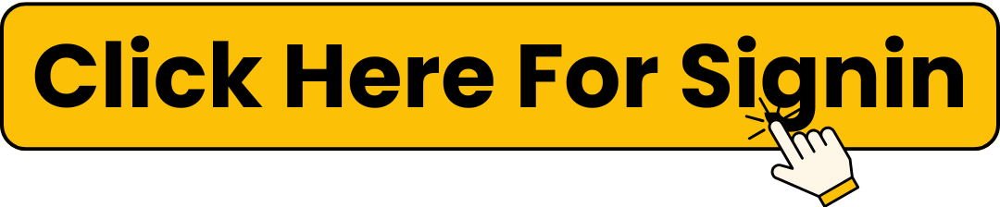

How To Sign In Club Pogo Account?
============================================
.
.

_____________________________

Club Pogo, an online gaming service offered by Electronic Arts, has captured the hearts of millions of casual gamers around the world. Known for its variety of games, from card and puzzle games to classic arcade and board games, Club Pogo offers a great experience for players of all ages. Whether you’re a seasoned gamer or a newcomer, having a Club Pogo account sign in is essential to fully access all the features of this beloved platform.

In this article, we will guide you through everything you need to know about signing into your Club Pogo account, explain the benefits of having an account, and help you troubleshoot common issues so you can enjoy all the fun without a hitch.

What Is Club Pogo?
________________________

Club Pogo is a premium membership service that enhances the Pogo gaming experience. While Pogo offers free-to-play games, Club Pogo takes it to the next level, offering access to exclusive content, ad-free gaming, early access to new games, special challenges, and much more.

With Club Pogo account sign in, members unlock these additional perks and gain a personalized, enjoyable gaming experience. Logging in to your account gives you access to various games, social features, rewards, and customization options, all under one account.

The Benefits of a Club Pogo Account
________________________

Signing up for a Club Pogo account sign in brings numerous benefits. If you’re new to Pogo or considering upgrading from the free version, here’s why you should consider creating a Club Pogo account:

Exclusive Access to Premium Games
________________________

One of the biggest perks of a Club Pogo account sign in is access to a wide range of premium games. These are exclusive titles that are only available to Club Pogo members. From puzzle games like Pogo Scrabble to exciting card games like Pogo Solitaire, these premium offerings provide hours of entertainment that you can’t get anywhere else.

Ad-Free Gaming Experience
________________________

A Club Pogo account sign in ensures that you play all your favorite games without interruptions from ads. This is especially beneficial for players who want to immerse themselves in the game without distractions. With Club Pogo, you can enjoy seamless gaming every time.

Early Access to New Games
________________________

As a Club Pogo account sign in member, you often get early access to new releases. This means you get to try out new games before they are available to free players. Being one of the first to try out new titles keeps the gaming experience fresh and exciting.

Rewards and Achievements
________________________

Club Pogo members enjoy exclusive rewards and achievements, including badges, trophies, and special game modes. These rewards not only give you a sense of accomplishment but also add an extra layer of fun as you complete challenges and level up.

Monthly and Special Events
________________________

Club Pogo members can participate in special monthly events, seasonal challenges, and exclusive tournaments. These events give players the opportunity to earn special rewards and compete for leaderboard rankings. Club Pogo account sign in makes it easy to keep track of these events and participate in them.

Priority Customer Support
________________________

If you encounter any issues, having a Club Pogo account sign in grants you priority customer support. Whether you’re having trouble with your account, a particular game, or something else, you’ll have direct access to support professionals who can assist you quickly.

How to Create a Club Pogo Account
________________________

Before you can sign in, you need to create a Club Pogo account sign in. Here’s a step-by-step guide to getting started:

1: Visit the Pogo Website
________________________

Head to the official Pogo website and navigate to the "Sign Up" page. You’ll need to provide a valid email address and other personal details to create your account.

2: Choose Your Membership Plan
________________________

During the sign-up process, you’ll be asked to choose a membership plan. Pogo offers a monthly or annual subscription for Club Pogo, with different payment options. Select the plan that best suits your gaming habits and preferences.

3: Create Your Username and Password
________________________

Create a unique username and password for your Club Pogo account sign in. Be sure to choose a password that is both strong and secure to protect your account from unauthorized access.

4: Provide Payment Information
________________________

Once you’ve selected your membership plan, you’ll need to provide payment details. Pogo accepts various payment methods, including credit cards, PayPal, and other forms of digital payment.

5: Confirm Your Email Address
________________________

After signing up, you will receive a confirmation email. Follow the link in the email to verify your address and activate your account. Once activated, you’re ready to sign in to your Club Pogo account and begin enjoying the full range of benefits.

How to Sign In to Your Club Pogo Account
________________________

After you’ve created your account, you’ll need to know how to sign in to your Club Pogo account to begin playing. Here’s how:

1: Visit the Club Pogo Website
________________________

Go to the official Pogo website and click on the “Sign In” button located in the top right corner of the page. This will take you to the login screen.

2: Enter Your Username and Password
________________________

On the Club Pogo account sign in page, enter the username and password you created during the registration process. Be sure to double-check your credentials to avoid any errors.

3: Click “Sign In”
________________________

Once your credentials are entered correctly, click the “Sign In” button. If you’ve entered the correct username and password, you will be logged into your account, and the homepage will load.

4: Enjoy the Games
________________________

After logging in, you’ll be able to access the full range of Pogo games, events, and features that come with a Club Pogo membership. Start playing your favorite games or check out new titles in the game library.

Troubleshooting Common Club Pogo Account Sign In Issues
________________________

Sometimes, you may face problems when trying to sign in to your Club Pogo account. Here are some common issues and their solutions:

Forgot Your Password?
________________________

If you forget your password, don’t worry! Simply click the “Forgot Password” link on the sign-in page. You’ll be prompted to enter your registered email address, and Pogo will send you a link to reset your password. Follow the instructions to create a new password and regain access to your account.

Incorrect Username or Email
________________________

If you can’t sign in because of an incorrect username or email, double-check that you are entering the correct information. If you’ve forgotten your username, you can retrieve it by contacting customer support.

Account Locked or Suspended
________________________

In some cases, your Club Pogo account sign in may be locked or suspended due to suspicious activity or a violation of Pogo’s terms of service. If this happens, contact Pogo’s customer support to resolve the issue.

Browser Compatibility Issues
________________________

If you’re unable to sign in because of browser-related problems, try clearing your cache and cookies. Alternatively, try using a different browser to access the Club Pogo account sign in page. Sometimes browser settings or extensions can interfere with the login process.

Subscription Issues
________________________

If your subscription has expired, you won’t be able to access the Club Pogo benefits. Check your payment details and subscription status in your account settings. If you’re having trouble renewing your subscription, contact customer support for assistance.

Maximizing Your Experience with Club Pogo
________________________

Now that you know how to sign in to your Club Pogo account, it’s time to make the most of your membership. Here are a few tips for maximizing your experience:

Participate in Challenges and Events
________________________

Club Pogo hosts regular challenges, events, and tournaments. Sign in daily to participate in these fun activities and earn exclusive rewards and badges. Keeping track of special events ensures you don’t miss out on limited-time opportunities.

Add Friends and Play Together
________________________

Use the social features of Club Pogo to add friends and play games together. Whether you’re challenging them in a Pogo Pool match or teaming up for a round of Pogo Bingo, the social aspect of the platform makes gaming even more enjoyable.

Explore New Games
________________________

With your Club Pogo account sign in, you get access to exclusive games. Keep an eye out for new releases and try them out. Whether you enjoy casual card games or more competitive strategy games, there’s always something new to discover.

Use the Game Helpers and Tips
________________________

Club Pogo offers various in-game helpers and tips to enhance your gaming experience. Whether it’s a guide for completing challenges or power-ups for boosting your scores, these tools are available to help you succeed in your games.

Conclusion
________________________

Your Club Pogo account sign in opens the door to a premium online gaming experience. With exclusive access to games, rewards, events, and a variety of social features, being a Club Pogo member enhances your gaming journey significantly. Whether you’re looking to relax, compete, or collect badges, Club Pogo provides a comprehensive and enjoyable experience for all types of gamers.
